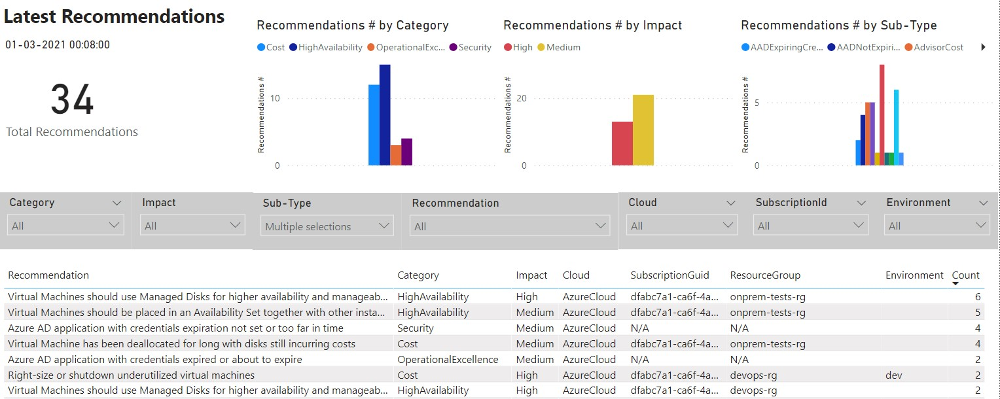
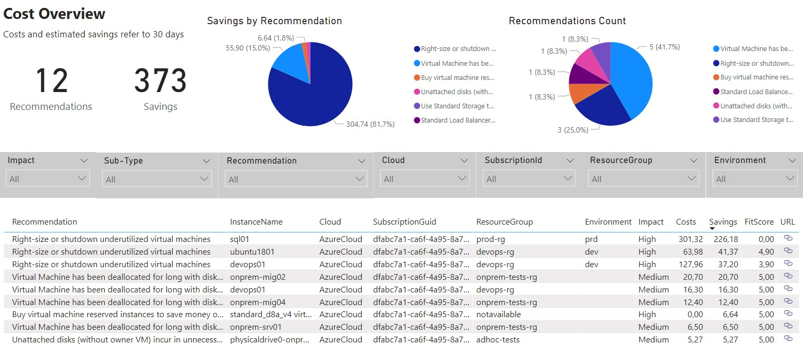
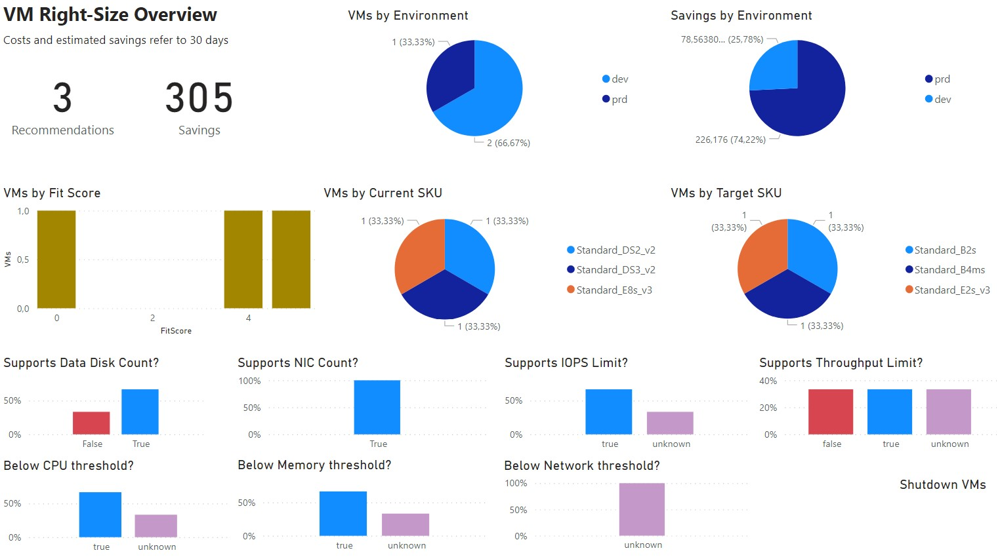
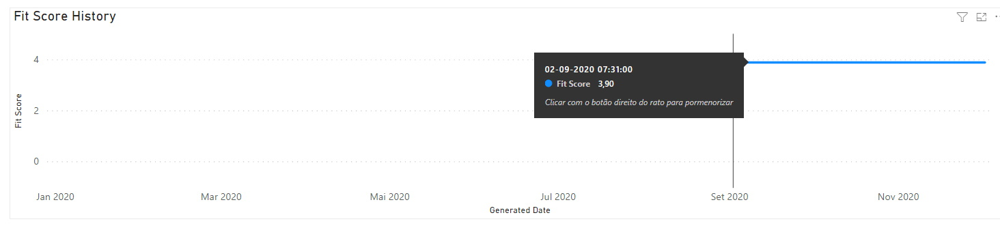
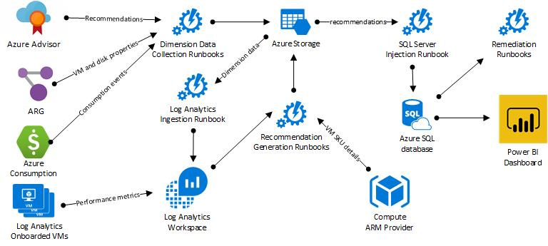
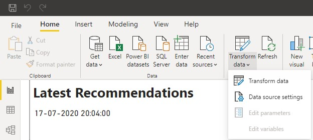
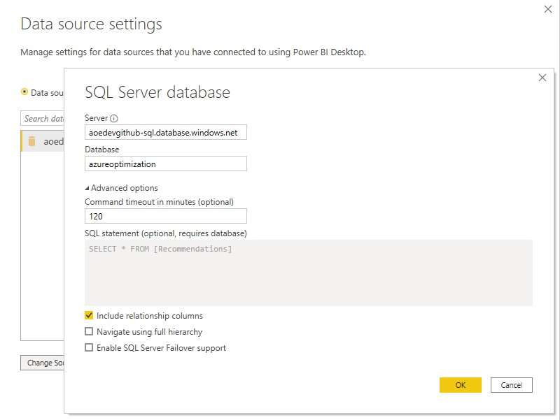
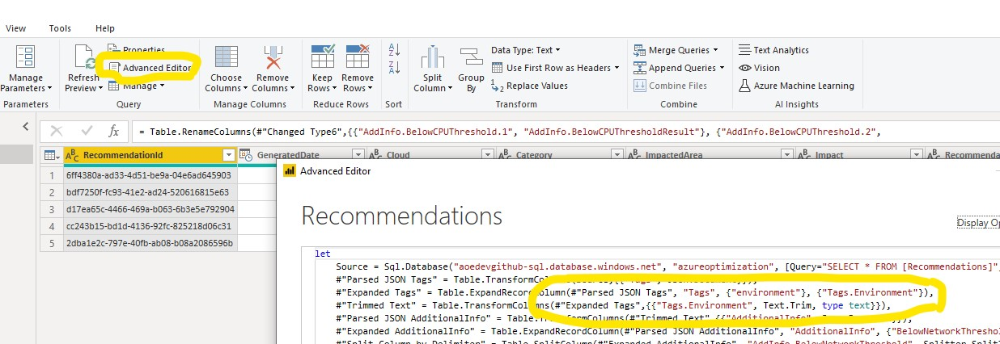

# Azure Optimization Engine

The Azure Optimization Engine (AOE) is an extensible solution designed to generate optimization recommendations for your Azure environment. See it like a fully customizable Azure Advisor. Actually, the first recommendations use-case covered by this tool was augmenting Azure Advisor Cost recommendations, particularly Virtual Machine right-sizing, with a fit score based on VM metrics and properties. Other recommendations can be easily added/augmented with this tool, not only for cost optimization but also for security, high availability and other [Well-Architected Framework](https://docs.microsoft.com/en-us/azure/architecture/framework/) areas.

It is highly recommended that you read the whole blog series dedicated to this project, starting [here](https://techcommunity.microsoft.com/t5/core-infrastructure-and-security/augmenting-azure-advisor-cost-recommendations-for-automated/ba-p/1339298). You'll find all the information needed to correctly set up the whole environment.

## What you can get

A few hours after setting up the engine, you'll get a Power BI dashboard with all Azure optimization opportunities, coming from both Azure Advisor and from custom recommendations included in the engine. These recommendations are then updated every 7 days and you can add/develop your own custom ones if desired. Check below some examples of the Power BI dashboard pages.

### Recommendations overview



### Cost opportunities overview



### Augmented VM right-size overview



### Fit score history for a specific recommendation



## Releases

* 01/2021 - solution deployment improvements and several new recommendations added
    * Support for Azure Cloud Shell (PowerShell) deployment
    * Solution upgrade keeps original runbook schedules
    * Eight new recommendations added
        * **Cost** - VMs that have been deallocated for a long time
        * **HA** - Availability Sets with a small fault domain count
        * **HA** - Availability Sets with a small update domain count
        * **HA** - Unmanaged Availability Sets with VMs sharing storage accounts
        * **HA** - Storage Accounts containing unmanaged disks from multiple VMs
        * **HA** - VMs without Availability Set
        * **HA** - Single VM Availability Sets
        * **HA** - VMs with unmanaged disks spanning multiple storage accounts
* 12/2020 - added Azure Consumption dimension to cost recommendations and refactored Power BI dashboard
* 11/2020 - support for automated VM right-size remediations and for other Well-Architected scopes, with unmanaged disks custom recommendation
* 07/2020 - [initial release] Advisor Cost augmented VM right-size recommendations and orphaned disks custom recommendation

## Architecture

The AOE runs mostly on top of Azure Automation and Log Analytics. The diagram below depicts the architectural components. For a more detailed description, please
read the whole blog series dedicated to this project, starting [here](https://techcommunity.microsoft.com/t5/core-infrastructure-and-security/augmenting-azure-advisor-cost-recommendations-for-automated/ba-p/1339298).



## Deployment instructions

You must first install the Az Powershell module (instructions [here](https://docs.microsoft.com/en-us/powershell/azure/install-az-ps)). Then, you can either choose to deploy all the dependencies from the GitHub repository or from your own. In any case, you must clone/download the solution locally, to be able to call the deployment script from a PowerShell **elevated prompt**.

During deployment, you'll be asked several questions. You must plan for the following:

* Whether you're going to reuse an existing Log Analytics Workspace or a create a new one
* Azure subscription to deploy the solution (if you're reusing a Log Analytics workspace, you must deploy into the same subscription the workspace is in).
* A unique name prefix for the Azure resources being created (if you have specific naming requirements, you can also choose resource names during deployment)
* Azure datacenter location
* Using a user account with Owner permissions over the chosen subscription and enough privileges to register Azure AD applications ([see details](https://docs.microsoft.com/en-us/azure/automation/manage-runas-account#permissions)).

If the deployment fails for some reason, you can simply repeat it, as it is idempotent. The same if you want to upgrade a previous deployment with the latest version of the repo. You just have to keep the same deployment options.

### Requirements

* Azure Powershell 4.5.0+

### Deploying from GitHub

```powershell
.\Deploy-AzureOptimizationEngine.ps1 [-AzureEnvironment <AzureChinaCloud|AzureUSGovernment|AzureGermanCloud|AzureCloud>]

# examples
.\Deploy-AzureOptimizationEngine.ps1

.\Deploy-AzureOptimizationEngine.ps1 -AzureEnvironment AzureChinaCloud
```

### Deploying from your own repo

You must publish the solution files into a publicly reachable URL. If you're using a Storage Account private container, you must also specify a SAS token.

```powershell
.\Deploy-AzureOptimizationEngine.ps1 -TemplateUri <URL to the ARM template JSON file (e.g., https://contoso.com/azuredeploy.json)> [-ArtifactsSasToken <Storage Account SAS token>] [-AzureEnvironment <AzureChinaCloud|AzureUSGovernment|AzureGermanCloud|AzureCloud>]

# examples
.\Deploy-AzureOptimizationEngine.ps1 -TemplateUri "https://contoso.com/azuredeploy.json"

.\Deploy-AzureOptimizationEngine.ps1 -TemplateUri "https://aoesa.blob.core.windows.net/files/azuredeploy.json" -ArtifactsSasToken "?sv=2019-10-10&ss=bfqt&srt=o&sp=rwdlacupx&se=2020-06-13T23:27:18Z&st=2020-06-13T15:27:18Z&spr=https&sig=4cvPayBlF67aYvifwu%2BIUw8Ldh5txpFGgXlhzvKF3%2BI%3D"
```

## Usage instructions

Once successfully deployed, and assuming you have your VMs onboarded to Log Analytics and collecting all the [required performance counters](https://techcommunity.microsoft.com/t5/core-infrastructure-and-security/augmenting-azure-advisor-cost-recommendations-for-automated/ba-p/1457687), we have everything that is needed to start augmenting Advisor recommendations and even generate custom ones!

This solution currently supports several types of recommendations, not restricted to Cost optimization:

* Advisor Cost recommendations augmented with a fit score based on Virtual Machine performance metrics (collected by Log Analytics agents) and Azure properties
* Delete unattached disks
* Upgrade Virtual Machines to Managed Disks

For Advisor Cost recommendations, the AOE's default configuration produces percentile 99th VM metrics aggregations, but you can adjust those to be less conservative. There are also adjustable metrics thresholds that are used to compute the fit score. The default thresholds values are 30% for CPU (5% for shutdown recommendations), 50% for memory (100% for shutdown) and 750 Mbps for network bandwidth (10 Mbps for shutdown). All the adjustable configurations are available as Azure Automation variables.

### Visualizing recommendations with Power BI

The AOE includes a [Power BI sample report](./views/GenericReport.pbix) for visualizing recommendations. To use it, you have first to change the data source connection to the SQL Database you deployed with the AOE. In the Power BI top menu, choose Transform Data > Data source settings.



Then click on "Change source" and change to your SQL database server URL (don't forget to ensure your SQL Firewall rules allow for the connection).



If the connection fails at the first try, this might be because the SQL Database was paused (it was deployed in the cheap Serverless plan). At the next try, the connection should open normally.

The report was built for a scenario where you have an "environment" tag applied to your resources. If you want to change this or add new tags, open the Transform Data menu again, but now choose the Transform data sub-option. A new window will open. If you click next in "Advanced editor" option, you can edit the data transformation logic and update the tag processing instructions.



### Adjusting Azure Automation Run As Account permissions

By default, the Azure Automation Run As Account is created with Contributor role over the respective subscription. The simplest minimum required permissions for the AOE runbooks are: 

* Reader role in every subscription you want to gather recommendations from.
* Contributor role in the resource group the solution was deployed to.

## Frequently Asked Questions

* **Is the AOE supported by Microsoft?** No, the Azure Optimization Engine is not supported under any Microsoft standard support program or service. The scripts are provided AS IS without warranty of any kind. The entire risk arising out of the use or performance of the scripts and documentation remains with you.

* **Why is my report empty?** Most of the Power BI report pages are configured to filter out recommendations older than 7 days. If it shows empty, just try to refresh the report data.

* **Why is my VM right-size recommendations overview page empty?** The AOE depends on Azure Advisor Cost recommendations for VM right-sizing. If no VMs are showing up, try increasing the CPU threshold in the Azure Advisor configuration... or maybe your infrastructure is not oversized after all!

* **Why am I getting an SQL timeout whenever I try to refresh the Power BI report after some time?** The default AOE setup deploys the recommendations database in a serverless plan. The database is paused after 1 hour without usage. If you try to connect to SQL in a paused state, it will awake the database but will return a timeout at the first try. If you don't want this to happen, upgrade the database to a non-serverless SKU.

* **Why am I getting values so small for costs and savings after setting up AOE?** The Azure consumption exports runbook has just begun its daily execution and only got one day of consumption data. After one month - or after manually kicking off the runbook for past dates -, you should see the correct consumption data.

* **What is the currency used for costs and savings?** The currency used is the one that is reported by default by the Azure Consumption APIs. It should match the one you usually see in Azure Cost Management.

