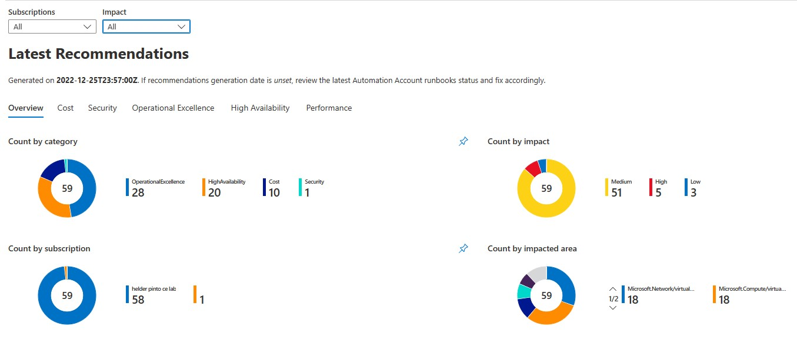
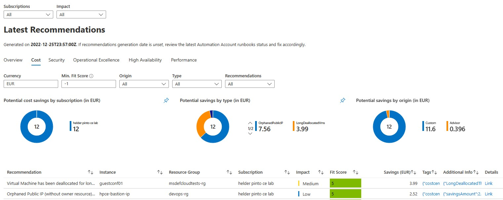
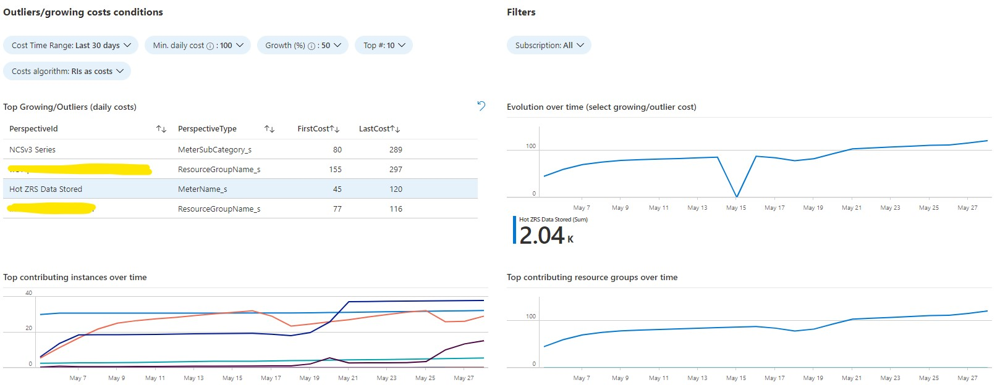
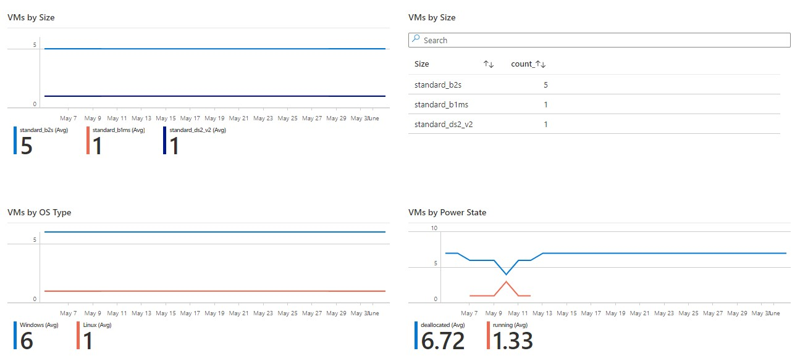
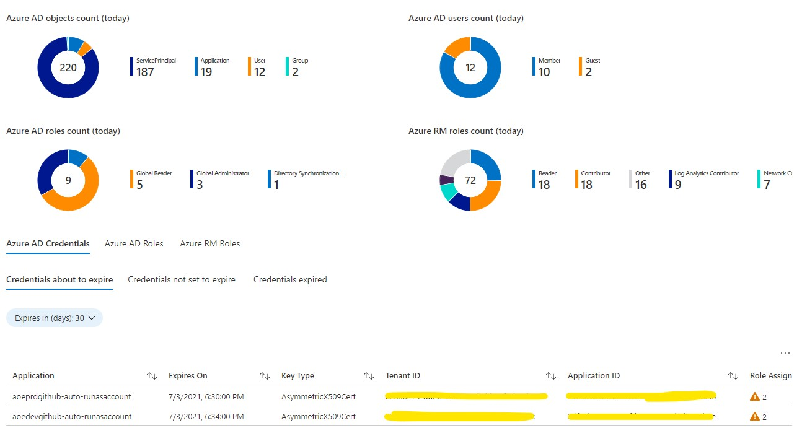
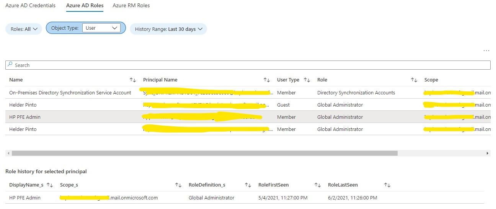
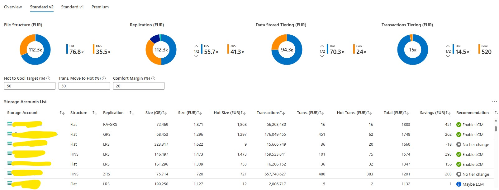
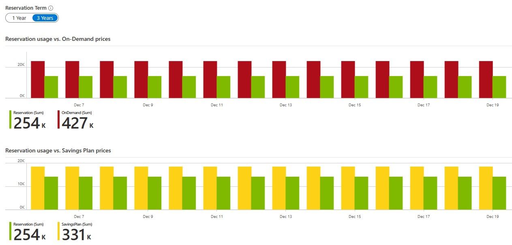
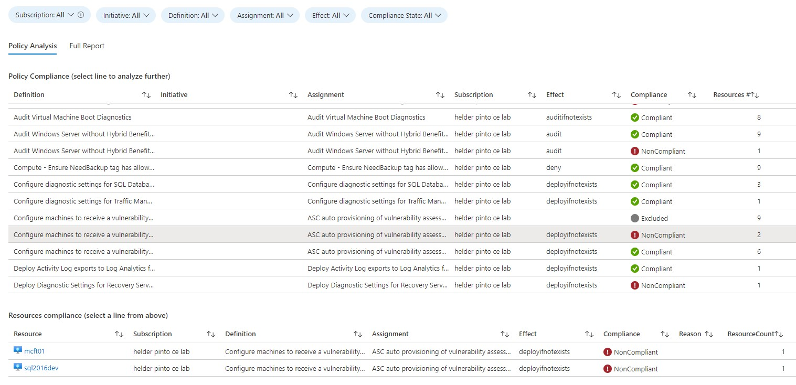

# Azure Optimization Engine

The Azure Optimization Engine (AOE) is an extensible solution designed to generate optimization recommendations for your Azure environment. See it like a fully customizable Azure Advisor. Actually, the first custom recommendations use-case covered by this tool was augmenting Azure Advisor Cost recommendations, particularly Virtual Machine right-sizing, with a fit score based on VM metrics and properties. Other recommendations are being added to the tool, not only for cost optimization but also for security, high availability and other [Well-Architected Framework](https://docs.microsoft.com/en-us/azure/architecture/framework/) pillars. You are welcome to contribute with new types of recommendations!

It is highly recommended that you read the whole blog series dedicated to this project, starting [here](https://techcommunity.microsoft.com/t5/core-infrastructure-and-security/augmenting-azure-advisor-cost-recommendations-for-automated/ba-p/1339298). You'll find all the information needed to understand the whole solution. [Luke Murray](https://github.com/lukemurraynz) wrote a great [Azure Spring Clean 2022 blog post](https://luke.geek.nz/azure/azure-optimization-engine) describing AOE and how to set it up, with full deployment and configuration steps.

## README index

* [What you can get](#whatyoucanget)
* [Releases](#releases)
* [Architecture](#architecture)
* [Deployment instructions](#deployment)
* [Usage instructions](#usage)
* [Upgrade instructions](#upgrade)
* [Frequently Asked Questions](#faq)

## <a id="whatyoucanget"></a>What you can get ##

A few hours after setting up the engine, you'll get a Power BI dashboard with all Azure optimization opportunities, coming from both Azure Advisor and from custom recommendations included in the engine. These recommendations are also available, with less detail, directly from the Azure Portal, via the Recommendations Workbook. Recommendations are updated every 7 days and you can contribute with your own custom ones if needed. Check below some examples of the Power BI dashboard and Recommendations Workbook pages.

### Built-in custom recommendations

Besides collecting **all Azure Advisor recommendations**, AOE includes other custom recommendations that you can tailor to your needs, such as:

* Cost
    * Augmented Advisor Cost VM right-size recommendations, with fit score based on Virtual Machine guest OS metrics (collected by Log Analytics agents) and Azure properties
    * Underutilized VM Scale Sets
    * Unattached disks
    * Standard Load Balancers without backend pool
    * Application Gateways without backend pool
    * VMs deallocated since a long time ago (forgotten VMs)
    * Orphaned Public IPs
    * Underutilized Azure SQL Databases (DTU-based SKUs only)
    * Storage Accounts without retention policy in place
    * Underutilized App Service Plans
    * App Service Plans without any application
    * Premium SSD disk has been underutilized
    * Virtual Machine is stopped (not deallocated) and still incurring costs
* High Availability
    * Virtual Machine high availability (availability zones count, availability set, managed disks, storage account distribution when using unmanaged disks)
    * VM Scale Set high availability (availability zones count, managed disks)
    * Availability Sets structure (fault/update domains count)
* Performance
    * VM Scale Sets constrained by lack of compute resources
    * SQL Databases constrained by lack of resources (DTU-based SKUs only)
    * App Service Plans constrained by lack of compute resources
* Security
    * Service Principal credentials/certificates without expiration date
    * NSG rules referring to empty or inexisting subnets
    * NSG rules referring to orphan or removed NICs
    * NSG rules referring to orphan or removed Public IPs
* Operational Excellence
    * Load Balancers without backend pool
    * Service Principal credentials/certificates expired or about to expire
    * Subscriptions close to the maximum limit of RBAC assignments
    * Management Groups close to the maximum limit of RBAC assignments
    * Subscriptions close to the maximum limit of resource groups
    * Subnets with low free IP space
    * Subnets with too much IP space wasted
    * Empty subnets
    * Orphaned NICs

### Recommendations overview (Azure Workbook)



### Cost opportunities overview (Azure Workbook)



### Recommendations overview (Power BI)


### Cost opportunities overview (Power BI)


### Augmented VM right-size overview (Power BI)


### Fit score history for a specific recommendation (Power BI)


### Log Analytics Workbooks

With AOE's Log Analytics Workbooks, you can explore many perspectives over the data that is collected every day. For example, costs growing anomalies, Microsoft Entra ID and Azure RM principals and roles assigned, how your resources are distributed, how your Block Blob Storage usage is distributed, how your Azure Benefits usage is distributed (supports only Enterprise Agreement customers) or exploring Azure Policy compliance results over time.















## <a id="releases"></a>Releases ##

* 12/2023
    * Added support for User-Assigned Managed Identity
    * Added tool for setting DCR-based (Azure Monitor Agent) performance counters collection
    * Changed deployment template from ARM to Bicep
    * Recommendations workbook: filtering by tags
    * New Cost recommendation added
        * Virtual Machine is stopped (not deallocated) and still incurring costs
    * New workbooks
        * Savings Plans Usage (preview)
    * Azure China consumption exports (preview)
    * Several bug fixes and performance, security, and usability improvements
* 09/2023
    * Added support for MCA, CSP Modern and other customer agreement types
    * New Cost recommendation added
        * Premium SSD disk has been underutilized
    * New workbooks (see [how to enable them](#enabling-the-reservations-and-benefits-usage-workbooks))
        * Benefits Simulation
        * Benefits Usage
        * Reservations Potential
        * Reservations Usage
    * Support for silent deployment/upgrade and optional Workbooks deployment (thanks to @wpouseele)
    * Support for AOE resources tags assignment at deployment/upgrade time
    * Policy Compliance workbook: filtering/grouping by tags
    * Several bug fixes and performance and security improvements
* 12/2022
    * Migrated from the deprecated Consumption API to the new Cost Details API
    * Recommendations report available also in Azure Workbook (besides Power BI)
    * New Cost recommendations added
        * Underutilized App Service Plans
        * App Service Plans without any application
    * New Performance recommendations added
        * SQL Databases constrained by lack of resources (DTU-based SKUs only)
        * App Service Plans constrained by lack of compute resources
    * New workbooks
        * Recommendations
        * Block Blob Storage Usage
        * Benefits Usage (preview, Enterprise Agreement customers only)
    * Several bug fixes and performance improvements
* 06/2022
    * New Cost recommendations added
        * Underutilized SQL Databases (DTU-based SKUs only)
        * Storage Accounts without retention policy in place
    * New workbooks
        * Policy Compliance
        * Reservations Potential (preview)
        * Reservations Usage (preview)
    * Added Storage Lifecycle Management policy, cleaning up CSVs older than 6 months (new deployments or full upgrades only)
    * Added SQL Database retention policy runbook to clean up recommendations older than 365 days (configurable)
    * Support for (any type of) existing SQL Server reuse (upgrade scenarios only, after manually migrating original database to new server)
    * Workbooks usability improvements
    * Runbook performance improvements
    * Several bug fixes
* 12/2021
    * Several new recommendations added
        * **Cost** - Underutilized VM Scale Sets
        * **Performance** - VM Scale Sets constrained by lack of compute resources
        * **High Availability** - VM Scale Sets not using managed disks
        * **High Availability** - Virtual Machines or VM Scale Sets not leveraging multiple Availability Zones
    * Microsoft Entra ID exports migrated to the Microsoft Graph SDK (preparing for the deprecation of Azure AD Graph)
    * Automation Runbooks use by default Managed Identity authentication (no more certificate-based Run As Accounts)
    * Support for resetting Automation schedules with the `Reset-AutomationSchedules.ps1` script
    * Workbooks usability and content improvements
    * Runbook performance improvements
    * Several bug fixes
* 09/2021
    * Several new recommendations added
        * **Operational Excellence** - Subscriptions close to the maximum limit of RBAC assignments
        * **Operational Excellence** - Management Groups close to the maximum limit of RBAC assignments
        * **Operational Excellence** - Subscriptions close to the maximum limit of resource groups
        * **Operational Excellence** - Subnets with low free IP space
        * **Operational Excellence** - Subnets with too much IP space wasted
        * **Operational Excellence** - Empty subnets
        * **Operational Excellence** - Orphan NICs
        * **Cost** - Orphan Public IPs
        * **Security** - NSG rules referring to empty or inexisting subnets
        * **Security** - NSG rules referring to orphan or removed NICs
        * **Security** - NSG rules referring to orphan or removed Public IPs
    * Two new remediations added
        * Downgrade long-deallocated VMs disks
        * Delete/downgrade unattached disks
    * Added Networking assets and RBAC assignments to the Resources Inventory Workbook
    * Simplified ARM template deployment
    * Upgraded PowerShell module dependencies
    * Merged VMs High Availability recommendations into a single runbook
    * Several bug fixes
* 06/2021
    * Introduced Log Analytics Workbooks with additional insights besides Power BI recommendations:
        * Identities and Roles - Microsoft Entra ID principals (user and service) and roles assigned both in Microsoft Entra ID and Azure RM, credentials expiration (for service principals)
        * Resouces Inventory (overall, VMs, disks, all with an historical perspective)
        * Costs Growing - cost anomalies observed during a specific period
    * Support for partial AOE upgrades - useful in scenarios where the solution was customized (e.g., Private Link or Hybrid Worker setups or changes in Automation Variables)
    * Added daily Microsoft Entra ID and Azure RM RBAC assignments exports
    * Added daily resource containers exports (subscriptions and resource groups)
    * Added OS and image models to VM exports
    * Improved support for US Government cloud
    * Support for Azure subscription names in recommendations
    * SQL Database component changed from Serveless to cheaper Basic plan
    * Several bug fixes
* 03/2021 - support for suppressions, new recommendations added and deployment improvements
    * Support for recommendations suppressions (exclude, dismiss, snooze)
    * Five new recommendations added
        * **Cost** - Standard Load Balancers without backend pool
        * **Cost** - Application Gateways without backend pool
        * **Security** - Service Principal credentials/certificates without expiration date
        * **Operational Excellence** - Service Principal credentials/certificates expired or about to expire
        * **Operational Excellence** - Load Balancers without backend pool
    * Helper script that checks whether Log Analytics workspaces are configured with the right performance counters (with auto-fix support)
    * Support for multiple Log Analytics workspaces (VM metrics ingestion by Log Analytics agents)
    * Last deployment options are stored locally to make upgrades/re-deployments easier
    * Roles assigned to the Automation Run As Account have now the least privileges needed
    * Recommendations Dismissed/Postponed in Azure Advisor are now filtered
    * Power BI report improvements
    * Several bug fixes
* 01/2021 - solution deployment improvements and several new recommendations added
    * Support for Azure Cloud Shell (PowerShell) deployment
    * Solution upgrade keeps original runbook schedules
    * Eight new recommendations added
        * **Cost** - VMs that have been deallocated for a long time
        * **High Availability** - Availability Sets with a small fault domain count
        * **High Availability** - Availability Sets with a small update domain count
        * **High Availability** - Unmanaged Availability Sets with VMs sharing storage accounts
        * **High Availability** - Storage Accounts containing unmanaged disks from multiple VMs
        * **High Availability** - VMs without Availability Set
        * **High Availability** - Single VM Availability Sets
        * **High Availability** - VMs with unmanaged disks spanning multiple storage accounts
* 12/2020 - added Azure Consumption dimension to cost recommendations and refactored Power BI dashboard
* 11/2020 - support for automated VM right-size remediations and for other Well-Architected scopes, with unmanaged disks custom recommendation
* 07/2020 - [initial release] Advisor Cost augmented VM right-size recommendations and orphaned disks custom recommendation

## <a id="architecture"></a>Architecture ##

The AOE runs mostly on top of Azure Automation and Log Analytics. The diagram below depicts the architectural components. For a more detailed description, please
read the whole blog series dedicated to this project, starting [here](https://techcommunity.microsoft.com/t5/core-infrastructure-and-security/augmenting-azure-advisor-cost-recommendations-for-automated/ba-p/1339298).


## <a id="deployment"></a>Deployment instructions ##

### Requirements

* A supported Azure subscription (see the [FAQs](#faq))
* Azure Powershell 6.6.0+
* Microsoft.Graph.Authentication and Microsoft.Graph.Identity.DirectoryManagement PowerShell modules (version 2.4.0+)
* A user account with Owner permissions over the chosen subscription, so that the Automation Managed Identity is granted the required privileges over the subscription (Reader) and deployment resource group (Contributor)
* (Optional) A user account with at least Privileged Role Administrator permissions over the Microsoft Entra tenant, so that the Managed Identity is granted the required privileges over Microsoft Entra ID (Global Reader)
* (Optional) A user account with administrative privileges over the Enterprise Agreement (Enterprise Enrollment Administrator) or the Microsoft Customer Agreement (Billing Profile Owner), so that the Managed Identity is granted the required privileges over your consumption agreement

During deployment, you'll be asked several questions. You must plan for the following:

* Whether you're going to reuse an existing Log Analytics Workspace or a create a new one. **IMPORTANT**: you should ideally reuse a workspace where you have VMs onboarded and already sending performance metrics (`Perf` table), otherwise you will not fully leverage the augmented right-size recommendations capability. If this is not possible/desired for some reason, you can still manage to use multiple workspaces (see [Configuring Log Analytics workspaces](./docs/configuring-workspaces.md)).
* An Azure subscription to deploy the solution (if you're reusing a Log Analytics workspace, you must deploy into the same subscription the workspace is in).
* A unique name prefix for the Azure resources being created (if you have specific naming requirements, you can also choose resource names during deployment)
* Azure region
* (Optional) Enterprise Agreement Billing Account ID (EA/MCA customers) and the Billing Profile IDs (MCA customers) 

Bear in mind that the AOE deployment creates the following (you cannot reuse any existing resource, except the Resource Group and the Log Analytics workspace):

* Azure Automation Account
* Storage Account
* Azure SQL Server + SQL Database
* (optional) Log Analytics workspace
* (optional) Resource Group

### Installation

The simplest, quickest and recommended method for installing AOE is by using the **Azure Cloud Shell** (PowerShell). You just have to follow these steps:

1. Open Azure Cloud Shell (PowerShell)
2. Run `git clone https://github.com/helderpinto/AzureOptimizationEngine.git azureoptimizationengine`
3. Run `cd azureoptimizationengine`
4. (optional) Run `Install-Module Microsoft.Graph.Authentication,Microsoft.Graph.Identity.DirectoryManagement` - this is required to grant the Global Reader role to the Automation Managed Identity in Microsoft Entra ID
5. Run `.\Deploy-AzureOptimizationEngine.ps1`
6. Input your deployment options and let the deployment finish (it will take less than 5 minutes)

If the deployment fails for some reason, you can simply repeat it, as it is idempotent. The same if you want to upgrade a previous deployment with the latest version of the repo. You just have to keep the same deployment options. _Cool feature_: the deployment script persists your previous deployment options and lets you reuse it! 

If you don't want to use Azure Cloud Shell and prefer instead to run the deployment from your workstation's file system, you must first install the Az Powershell module (instructions [here](https://docs.microsoft.com/en-us/powershell/azure/install-az-ps)) and also the Microsoft.Graph modules (instructions [here](https://docs.microsoft.com/en-us/graph/powershell/installation)).

Optionally, you can specify the set of tags you want to assign to your AOE resources, by using the `ResourceTags` input parameter. For example:

```powershell
$tags = @{"Service"="aoe";"Environment"="Demo"}
.\Deploy-AzureOptimizationEngine.ps1 -ResourceTags $tags
```

If you choose to deploy all the dependencies from your own local repository, you must publish the solution files into a publicly reachable URL. You must ensure the entire AOE project structure is available at the same base URL. Storage Account SAS Token-based URLs are not supported.

```powershell
.\Deploy-AzureOptimizationEngine.ps1 -TemplateUri <URL to the Bicep file (e.g., https://contoso.com/azuredeploy.bicep)> [-AzureEnvironment <AzureUSGovernment|AzureGermanCloud|AzureCloud>]

# Example - Deploying from a public endpoint
.\Deploy-AzureOptimizationEngine.ps1 -TemplateUri "https://contoso.com/azuredeploy.bicep"

# Example 2 - Deploying from a public endpoint, using resource tags
$tags = @{"CostCenter"="FinOps";"Environment"="Production"}
.\Deploy-AzureOptimizationEngine.ps1 -TemplateUri "https://contoso.com/azuredeploy.bicep" -ResourceTags $tags
```

Optionally, you can also use the `SilentDeploymentSettingsPath` input parameter to deploy AOE in a more automated way.  
The file referencing should be a JSON file with the needed attributes defined.  
An example of the content of such silent deployment file is:

```json
{
    "SubscriptionId": "<<SubscriptionId>>",                         // mandatory, subscription where AOE needs to be deployed
    "NamePrefix": "<<CustomNamePrefix>>",                           // mandatory, prefix for all resources. Fill in 'EmptyNamePrefix' to specify the resource names
    "WorkspaceReuse": "n",                                          // mandatory, y/n, y = reuse existing workspace, n = create new workspace
    "ResourceGroupName": "<<CustomName>>-rg",                       // mandatory if NamePrefix is set to 'EmptyNamePrefix', otherwise optional
    "StorageAccountName": "<<CustomName>>sa",                       // mandatory if NamePrefix is set to 'EmptyNamePrefix', otherwise optional
    "AutomationAccountName": "<<CustomName>>-auto",                 // mandatory if NamePrefix is set to 'EmptyNamePrefix', otherwise optional
    "SqlServerName": "<<CustomName>>-sql",                          // mandatory if NamePrefix is set to 'EmptyNamePrefix', otherwise optional
    "SqlDatabaseName": "<<CustomName>>-db",                         // mandatory if NamePrefix is set to 'EmptyNamePrefix', otherwise optional
    "WorkspaceName": "<<ExistingName>>",                            // mandatory if workspaceReuse is set to 'n', otherwise optional
    "WorkspaceResourceGroupName": "<<ExistingName>>",               // mandatory if workspaceReuse is set to 'n', otherwise optional
    "DeployWorkbooks": "y",                                         // mandatory, y/n, y = deploy the workbooks, n = don't deploy the workbooks
    "SqlAdmin": "<<sqlaAdmin>>",                                    // mandatory
    "SqlPass": "<<sqlPass>>",                                       // mandatory
    "TargetLocation": "westeurope",                                 // mandatory
    "DeployBenefitsUsageDependencies": "y",                         // mandatory, y/n, deploy the dependencies for the Azure Benefits usage workbooks (EA/MCA customers only + agreement administrator role required
    "CustomerType": "MCA",                                          // mandatory if DeployBenefitsUsageDependencies is set to 'y', MCA/EA
    "BillingAccountId": "<guid>:<guid>_YYYY-MM-DD",                 // mandatory if DeployBenefitsUsageDependencies is set to 'y', MCA or EA Billing Account ID
    "BillingProfileId": "ABCD-DEF-GHI-JKL",                         // mandatory if CustomerType is set to 'MCA", otherwise optional
    "CurrencyCode": "EUR"                                           // mandatory if DeployBenefitsUsageDependencies is set to 'y', EUR/USD/...
  }
  
```

### <a id="upgrade"></a>Upgrading AOE ##

If you have a previous version of AOE and wish to upgrade, it's as simple as re-running the deployment script with the resource naming options you chose at the initial deployment. It will re-deploy the ARM template, adding new resources and updating existing ones.

However, if you previously customized components such as Automation variables or schedules, improved job execution performance with Hybrid Workers, or hardened the solution with Private Link, then you should run the deployment script with the `DoPartialUpgrade` switch, e.g.:

`.\Deploy-AzureOptimizationEngine.ps1 -DoPartialUpgrade`

With the `DoPartialUpgrade` switch, the deployment will only:

* Add new storage containers
* Update/add Automation runbooks
* Update/add Automation modules
* Add new Automation schedules
* Add new Automation variables
* Upgrade the SQL database model
* Update Log Analytics Workbooks

Some customers may also customize the SQL Server deployment, for example, migrating from SQL Database to a SQL Managed Instance. There is no tooling available to assist in the migration, but once the database migration is done manually, the AOE upgrade script supports future `DoPartialUpgrade` upgrades with the `IgnoreNamingAvailabilityErrors` switch on (skips SQL Server naming/existence validation).

## <a id="usage"></a>Usage instructions ##

Once successfully deployed, and assuming you have your VMs onboarded to Log Analytics and collecting all the [required performance counters](https://techcommunity.microsoft.com/t5/core-infrastructure-and-security/augmenting-azure-advisor-cost-recommendations-for-automated/ba-p/1457687), we have everything that is needed to start augmenting Advisor recommendations and even generate custom ones! The first recommendations will be available more or less 3h30m after the deployment. In order to see them, you just have to open the Recommendations Workbook. For a more detailed analysis, you'll need to connect Power BI to the AOE database (see details below). Every week at the same time, AOE recommendations will be updated according to the current state of your environment.

### Validating whether Log Analytics is collecting the right performance counters

To ensure the VM right-size recommendations have all the required data to provide its full value, Log Analytics must be collecting specific performance counters. Depending on the type of agent your are using to monitor your machines (Log Analytics agent or Azure Monitor Agent) you can use a helper tool for a quick configuration of the pre-requisites. For more details, see [Configuring Log Analytics workspaces](./docs/configuring-workspaces.md).

### Widening the scope of AOE recommendations - more subscriptions or more workspaces

By default, the Azure Automation Managed Identity is assigned the Reader role only over the respective subscription. However, you can widen the scope of its recommendations just by granting the same Reader role to other subscriptions or, even simpler, to a top-level Management Group.

In the context of augmented VM right-size recommendations, you may have your VMs reporting to multiple workspaces. If you need to include other workspaces - besides the main one AOE is using - in the recommendations scope, you just have to add their workspace IDs to the `AzureOptimization_RightSizeAdditionalPerfWorkspaces` variable (see more details in [Configuring Log Analytics workspaces](./docs/configuring-workspaces.md)).

### Adjusting AOE thresholds to your needs

For Advisor Cost recommendations, the AOE's default configuration produces percentile 99th VM metrics aggregations, but you can adjust those to be less conservative. There are also adjustable metrics thresholds that are used to compute the fit score. The default thresholds values are 30% for CPU (5% for shutdown recommendations), 50% for memory (100% for shutdown) and 750 Mbps for network bandwidth (10 Mbps for shutdown). All the adjustable configurations are available as Azure Automation variables (for example, `AzureOptimization_PerfPercentile*` and `AzureOptimization_PerfThreshold*`).

For all the available customization details, check [Customizing the Azure Optimization Engine](./docs/customizing-aoe.md).

### Changing the schedules for the exports and recommendations runbooks

By default, the base time for the AOE Automation schedules is set as the deployment time. Soon after the initial deployment completes, the exports, ingests and recommendations runbooks will run according to the engine's default schedules. For example, if you deploy AOE on a Monday at 11:00 a.m., you will get new recommendations every Monday at 2:30 p.m.. If this schedule, for some reason, does not fit your needs, you can reset it to the time that better suits you, by using the `Reset-AutomationSchedules.ps1` script. You just have to call the script following the syntax below and answer the input requests:

```powershell
./Reset-AutomationSchedules.ps1 -AutomationAccountName <AOE automation account> -ResourceGroupName <AOE resource group> [-AzureEnvironment <AzureUSGovernment|AzureGermanCloud|AzureCloud>]
```

The base time you choose must be in UTC and must be defined according to the week day and hour you want recommendations to be generated. You must deduce 3h30m from the time you choose, because the base time defines the schedules for all the dependent automation runbooks that must run before the recommendations are generated. For example, let's say you want recommendations to be generated every Monday at 8h30 a.m.; the base time will be the next calendar date falling on a Monday, at 5h00 a.m.. The format of the date you choose must be YYYY-MM-dd HH:mm:ss, e.g., 2022-01-03 05:00:00.

The script will also ask you to enter, **if needed**, the Hybrid Worker Group you want the runbooks to run in (see the next sub-section).

### Changing the runbooks execution context to Hybrid Worker

By default, AOE Automation runbooks are executed in the context of the Azure Automation sandbox. If you face performance issues due to the memory limits of the Automation sandbox or decide to implement private endpoints for the Storage Account or SQL Database, to harden AOE's security, you will need to execute runbooks from a Hybrid Worker (an Azure or on-premises Virtual Machine with the Automation Hybrid Worker extension). To change the execution context for the AOE runbooks, you must use the `Reset-AutomationSchedules.ps1` script. See how to use the script in the previous sub-section and, after setting the runbooks execution base time, enter the Hybrid Worker Group name you want the runbooks to run in.

**IMPORTANT**: 
* The Hybrid Worker machine must have the required PowerShell modules installed. See [here](upgrade-manifest.json) the list of required modules.
* Once you change the runbook execution context to Hybrid Worker, you will have to always use the `DoPartialUpgrade` flag whenever you upgrade AOE, or else you will lose the runbook schedule settings and revert to the default sandbox configuration.
* The Managed Identity used to authenticate against Azure, Microsoft Entra ID and Billing Account scopes is still the Azure Automation's one, even if the Hybrid Worker machine has a Managed Identity assigned ([see details](https://learn.microsoft.com/en-us/azure/automation/automation-hrw-run-runbooks?#runbook-auth-managed-identities)). User-assigned Managed Identities are supported in the context of Hybrid Workers only if 1) the Automation Account does not have any associated Managed Identity, i.e., only the Hybrid Worker machine can have a User-Assigned Managed Identity; 2) all runbooks run in the context of the Hybrid Worker. In this case, you must create an `AzureOptimization_UAMIClientID` Automation Variable with the User-Assigned Managed Identity Client ID as value; and 3) the `AzureOptimization_AuthenticationOption` Automation variable value is updated to `UserAssignedManagedIdentity`.

### Visualizing recommendations with Power BI

The AOE includes a [Power BI sample report](./views/AzureOptimizationEngine.pbix) for visualizing recommendations. To use it, you have first to change the data source connection to the SQL Database you deployed with the AOE. In the Power BI top menu, choose Transform Data > Data source settings.


Then click on "Change source" and change to your SQL database server URL (don't forget to ensure your SQL Firewall rules allow for the connection).


If the connection fails at the first try, this might be because the SQL Database was paused (it was deployed in the cheap Serverless plan). At the next try, the connection should open normally.

The report was built for a scenario where you have an "environment" tag applied to your resources. If you want to change this or add new tags, open the Transform Data menu again, but now choose the Transform data sub-option. A new window will open. If you click next in "Advanced editor" option, you can edit the data transformation logic and update the tag processing instructions.


### Suppressing recommendations

If some recommendation is not applicable or you want it to be removed from the report while you schedule its mitigation, you can suppress it, either for a specific resource, resource group, subscription or even solution-wide. See [Suppressing recommendations](./docs/suppressing-recommendations.md) for more details.

### Enabling the Reservations and Benefits Usage workbooks

In order to leverage the Workbooks that allow you to analyze your Azure benefits usage (`Benefits Usage` and `Reservations Usage`) or estimate the impact of doing additional consumption commitments (`Benefits Simulation` and `Reservations Potential`), you need to configure AOE and grant privileges to its Managed Identity at your consumption agreement level (EA or MCA). If you could not do it during setup/upgrade, you can still execute those extra configuration steps, provided you do it with a user that is **both Contributor in the AOE resource group and have administrative privileges over the consumption agreement** (Enterprise Enrollment Administrator for EA or Billing Profile Owner for MCA). You just have to use the `Setup-BenefitsUsageDependencies.ps1` script following the syntax below and answer the input requests:

```powershell
./Setup-BenefitsUsageDependencies.ps1 -AutomationAccountName <AOE automation account> -ResourceGroupName <AOE resource group> [-AzureEnvironment <AzureUSGovernment|AzureGermanCloud|AzureCloud>]
```

If you run into issues with the Azure Pricesheet ingestion (due to the large size of the CVS export), you can create the following Azure Automation variable, to filter in the Price Sheet regions: `AzureOptimization_PriceSheetMeterRegions` set to the comma-separated billing regions of your virtual machines (e.g. *EU West,EU North*).

The Reservations Usage Workbook has a couple of "Unused Reservations" tiles that require AOE to export Consumption data at the EA/MCA scope (instead of the default Subscription scope). You can switch to EA/MCA scope consumption by creating/updating the `AzureOptimization_ConsumptionScope` Automation variable with `BillingAccount` as value. Be aware that this option may generate a very large single consumption export which may lead to errors due to lack of memory (this would in turn require [deploying AOE with a Hybrid Worker](#changing-the-runbooks-execution-context-to-hybrid-worker)).

## <a id="faq"></a>Frequently Asked Questions ##

* **Is the AOE supported by Microsoft?** No, the Azure Optimization Engine is not supported under any Microsoft standard support program or service. The scripts are provided AS IS without warranty of any kind. The entire risk arising out of the use or performance of the scripts and documentation remains with you.

* **What type of Azure subscriptions/clouds are supported?** AOE has been deployed and tested against EA, MCA and MSDN subscriptions in the Azure commercial cloud (AzureCloud). Although not tested yet, it should also work in MOSA subscriptions. It was designed to also operate in the US Government cloud, though it was never tested there. Sponsorship (MS-AZR-0036P and MS-AZR-0143P), CSP (MS-AZR-0145P, MS-AZR-0146P, and MS-AZR-159P) DreamSpark (MS-AZR-0144P) and Internal subscriptions should also work, but due to lack of availability or disparities in their consumption (billing) exports models, some of the Workbooks may not fully work.

* **Why is my Power BI report empty?** Most of the Power BI report pages are configured to filter out recommendations older than 7 days. If it shows empty, just try to refresh the report data.

* **Why is my VM right-size recommendations overview page empty?** The AOE depends on Azure Advisor Cost recommendations for VM right-sizing. If no VMs are showing up, try increasing the CPU threshold in the Azure Advisor configuration... or maybe your infrastructure is not oversized after all!

* **Why are my VM right-size recommendations showing up with so many Unknowns for the metrics thresholds?** The AOE depends on your VMs being monitored by Log Analytics agents and configured to send a set of performance metrics that are then used to augment Advisor recommendations. See more details [here](https://techcommunity.microsoft.com/t5/core-infrastructure-and-security/augmenting-azure-advisor-cost-recommendations-for-automated/ba-p/1457687).

* **Why am I getting values so small for costs and savings after setting up AOE?** The Azure consumption exports runbook has just begun its daily execution and only got one day of consumption data. After one month - or after manually kicking off the runbook for past dates -, you should see the correct consumption data.

* **What is the currency used for costs and savings?** The currency used is the one that is reported by default by the Azure Consumption APIs. It should match the one you usually see in Azure Cost Management.

* **What is the default time span for collecting Azure consumption data?** By default, the Azure consumption exports daily runbook collects 1-day data from 7 days ago. This offset works well for many types of subscriptions. If you're running AOE in PAYG or EA subscriptions, you can decrease the offset by adjusting the `AzureOptimization_ConsumptionOffsetDays` variable. However, using a value less than 2 days is not recommended.

* **Why is AOE recommending to delete a long-deallocated VM that was deallocated just a few days before?** The _LongDeallocatedVms_ recommendation depends on accurate Azure consumption exports. If you just deployed AOE, it hasn't collected consumption long enough to provide accurate recommendations. Let AOE run at least for 30 days to get accurate recommendations.

* **Why is AOE recommending to delete a long-deallocated VM that was already deleted?** Due to the fact that Azure consumption exports are collected with a (default) offset of 7 days, the _LongDeallocatedVms_ recommendation might recommend for deletion a long-deallocated VM that was meanwhile deleted. That false positive should normally disappear in the next iteration.

* **How much does running AOE in my subscription cost?** The default AOE deployment requires cheap Azure resources: an Azure Automation account, an Azure SQL Database and a Storage Account. The costs will depend on the size of your environment, but even in customers with thousands of VMs, the costs do not amount to more than 50 EUR/month. In small to medium-sized environments, it will cost less than 20 EUR/month. **These costs do not include VM performance metrics ingestion into Log Analytics**.