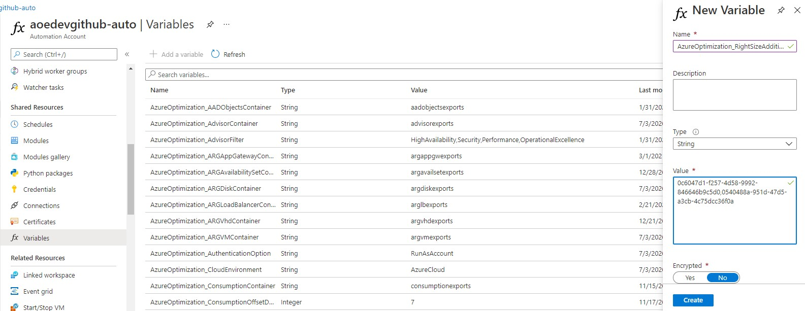

# Configuring Log Analytics workspaces

## Validating/configuring performance counters collection

If you want to fully leverage the VM right-size augmented recommendation, you need to have your VMs sending logs to a Log Analytics workspace (it should normally be the one you chose at AOE installation time, but it can be a different one) and you need them to send specific performance counters. The list of required counters is defined [here](../perfcounters.json). The AOE provides a couple of tools that help you validate and fix the configured Log Analytics performance counters, depending on the type of agent you are using to collect logs from your machines.

### Azure Monitor Agent (preferred approach)

With the help of the [Setup-DataCollectionRules.ps1](./Setup-DataCollectionRules.ps1) script, you can create a couple of Data Collection Rules (DCR) - one per OS type - that you configure to stream performance counters to the Log Analytics workspace of your choice. After creating the DCRs with the script below, you just have to manually or automatically (e.g., with Azure Policy) associate your VMs to the respective DCRs.

#### Requirements

```powershell
Install-Module -Name Az.Accounts
Install-Module -Name Az.Resources
Install-Module -Name Az.OperationalInsights
```

#### Usage

```powershell
./Setup-DataCollectionRules.ps1 -DestinationWorkspaceResourceId <Log Analytics workspace ARM resource ID> [-AzureEnvironment <AzureChinaCloud|AzureUSGovernment|AzureCloud>] [-IntervalSeconds <performance counter collection frequency - default 60>] [-ResourceTags <hashtable with the tag name/value pairs to apply to the DCR>]

# Example 1 - create Linux and Windows DCRs with the default options
./Setup-DataCollectionRules.ps1 -DestinationWorkspaceResourceId "/subscriptions/00000000-0000-0000-0000-000000000000/resourceGroups/myResourceGroup/providers/Microsoft.OperationalInsights/workspaces/myWorkspace"

# Example 2 - create DCRs using a custom counter collection frequency and assigning specific tags
./Setup-DataCollectionRules.ps1 -DestinationWorkspaceResourceId "/subscriptions/00000000-0000-0000-0000-000000000000/resourceGroups/myResourceGroup/providers/Microsoft.OperationalInsights/workspaces/myWorkspace" -IntervalSeconds 30 -ResourceTags @{"tagName"="tagValue";"otherTagName"="otherTagValue"}
```

### Log Analytics agent (legacy Microsoft Monitoring Agent)

With the help of the [Setup-LogAnalyticsWorkspaces.ps1](./Setup-LogAnalyticsWorkspaces.ps1) script, you can validate and fix the configured Log Analytics performance counters on the workspaces of your choice. In its simplest form of usage, it looks at all the Log Analytics workspaces you have access to and, for each workspace with Azure VMs onboarded, it validates performance counters configuration and tells you which counters are missing. But you can target a specific workspace and, if required, automatically fix the missing counters. See usage details below.

#### Requirements

```powershell
Install-Module -Name Az.Accounts
Install-Module -Name Az.ResourceGraph
Install-Module -Name Az.OperationalInsights
```

#### Usage

```powershell
./Setup-LogAnalyticsWorkspaces.ps1 [-AzureEnvironment <AzureChinaCloud|AzureUSGovernment|AzureGermanCloud|AzureCloud>] [-WorkspaceIds <comma-separated list of Log Analytics workspace IDs to validate>] [-IntervalSeconds <performance counter collection frequency - default 60>] [-AutoFix]

# Example 1 - just check all the workspaces configuration
./Setup-LogAnalyticsWorkspaces.ps1

# Example 2 - fix all workspaces configuration (using default counter collection frequency)
./Setup-LogAnalyticsWorkspaces.ps1 -AutoFix

# Example 3 - fix specific workspaces configuration, using a custom counter collection frequency
./Setup-LogAnalyticsWorkspaces.ps1 -AutoFix -WorkspaceIds "d69e840a-2890-4451-b63c-bcfc5580b90f","961550b2-2c4a-481a-9559-ddf53de4b455" -IntervalSeconds 30
```

## Estimating the cost of onboarding additional VMs or adding missing performance metrics

Each performance counter entry in the `Perf` table has different sizings, depending on the [7 required counters](../perfcounters.json) per OS type. The following table enumerates the size (in bytes) per performance counter entry.

OS Type | Object | Counter | Size | Collections per interval/VM
--- | --- | --- | ---: | --- |
Windows | Processor | % Processor Time | 200 | 1 + vCPUs count
Windows | Memory | Available MBytes | 220 | 1
Windows | LogicalDisk | Disk Read Bytes/sec | 250 | 3 + data disks count
Windows | LogicalDisk | Disk Write Bytes/sec | 250 | 3 + data disks count
Windows | LogicalDisk | Disk Reads/sec | 250 | 3 + data disks count
Windows | LogicalDisk | Disk Writes/sec | 250 | 3 + data disks count
Windows | Network Adapter | Bytes Total/sec | 290 | network adapters count
Linux | Processor | % Processor Time | 200
Linux | Memory | % Used Memory | 200
Linux | Logical Disk | Disk Read Bytes/sec | 250 | 3 + data disks count
Linux | Logical Disk | Disk Write Bytes/sec | 250 | 3 + data disks count
Linux | Logical Disk | Disk Reads/sec | 250 | 3 + data disks count
Linux | Logical Disk | Disk Writes/sec | 250 | 3 + data disks count
Linux | Network | Total Bytes | 200 | network adapters count

In summary, a Windows VM generates, in average, 245 bytes per performance counter entry, while a Linux consumes a bit less, 230 bytes per entry. However, depending on the number of CPU cores, data disks or network adapters, a VM will generate more or less Log Analytics entries. For example, a Windows VM with 4 vCPUs, 1 data disk and 5 network adapters will generate 5 * 200 + 220 + 4 * 250 + 4 * 250 + 4 * 250 + 4 * 250 + 5 * 290 = 6670 bytes (6.5 KB) per collection interval. If you set your Performance Counters interval to 60 seconds, then you'll have 60 * 24 * 30 * 6.5 = 280800 KB (274 MB) of ingestion data per month, which means less than 0.70 EUR/month at the Log Analytics ingestion retail price (Pay As You Go).

## Using multiple Log Analytics workspaces for VM performance metrics

If you have VMs onboarded to multiple Log Analytics workspaces and you want them to be fully included in the VM right-size recommendations report, you can add those workspaces to the solution just by adding a new variable to the AOE Azure Automation account. In the Automation Account _Shared Resources - Variables_ menu option, click on the _Add a variable button_ and enter `AzureOptimization_RightSizeAdditionalPerfWorkspaces` as the variable name and fill in the comma-separated list of workspace IDs (see example below). Finally, click on _Create_.

